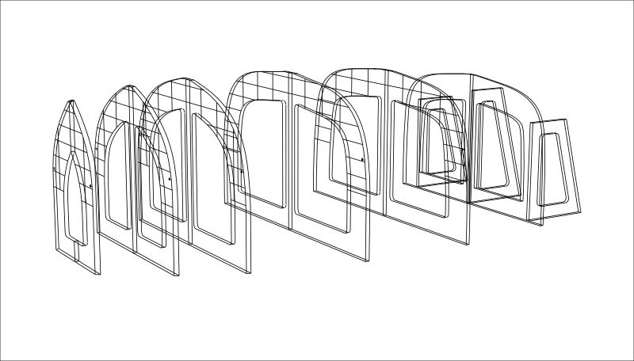

#2024 Beetle Cat BBR Digital Initiative

## About this repository

This repository serves to keep track of and archive work related to the digital lofting and creation of experimental station molds for a Beetle Cat at IYRS.

Most of this work, other than some to do with actually printing out a drawing, is contained in the main rhino file. 

Our **source of truth** (master table of offsets) is located in a google drive which has been shared with Bill K. These offsets were measured at the beginning of June 2024, and had to tweaked quite a bit to get the Beetle Cat lines to cross-reference nicely. That said, quite a lot of effort was put in keeping these deviations to less than 1/16" deviations on perpendicular intersections.

The fairness of the hull was checked extensively by comparing clipping planes to the waterlines and butt-lines in multiple Beetle Cat loftings, as well as through extensive use of curvature graphs, curve rebuilds, and zebra patterning.

## About the Rhino File

### Molds

The Rhino file contains a set of station molds, along with three transom support molds, all to a 1" plywood thickness. There is also a set of 1:3 scaled molds. Care **must** be taken to preserve corresponding distances between the molds when scaling, and **molds cannot be scaled only with the `scale` command**. This is because the `scale` command will alter the bevel of the molds - instead, I've provided part of a definition in the GH file that allows for the creation of scale molds; only rough shapes are produced, and these have to be further processed for final minafucture. 

Once appropriately sized, supporting length-wise stringers can be made quite simply by a difference operation in order to slot into the molds and preserve their spacing when being installed. Also, optional *clamp holes* have been included, which can be used to difference out mold geometry and provide convenient locations for clamping.

**Engraving** marks have been provided as lines and font-engraving outlines on the front surface of each mold. These marks correspond to the butt and waterlines, as well as a mark that denotes the *sheer* line as it tracks through the molds.

### Hulls

The file also contains **two** hulls - an *external* hull as measured from the master loftings, and an *internal* hull which has been offset 0.5" inwards, and re-cut using a rabbet projected inwards on the Y-Z plane. The molds are created using the *internal* hull as reference.

### Grid

The file contains a grid that matches standard lofting conventions.

## About the Grasshopper File

The geometry in the Rhino file is created parametrically through a pretty heavy Grasshopper definition - most of it has been annotated.

### Unit conversion PyScript

In order to get around the whole imperial-to-decimal-inches constraint, I wrote a small regex script that reads anything resembling a `ft'in-fraction"` notation, including each component on its own (i.e. just `23/32"`) and spits out a decimal representation. I think this might prove helpful in future digital/BBR projects, please feel free to use the script and modify it.

### Lofting measurement inputs

The simplest way to input all of the numerical information from the master measurement file into grasshopper, while also making it responsive, was to create multi-line panels where each "unit" of information is a tuple like such: `STA1WL12, 4-3/5", 1'3", 20"`, where the title of the section gets thrown out and the units processed as a tree branch. This means you can actively play with the measurements and watch everything downstream change.

### Things provided by the Grasshopper file

- Fair Sections
- Fair Rabbet/Stemline
- Fair Sheer
- Internal and External hulls
- Transom plane
- Rudimentary mold shape
- Mold internal-cutout curves 

